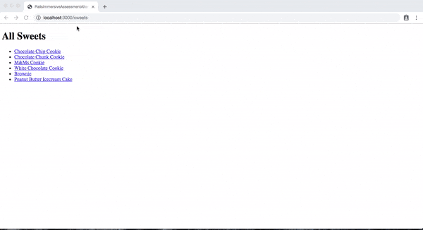

# Rails Code Challenge - Sweets Vendors

For this assessment, you'll be working with a vendors and sweets domain.

In this repo, there is a Rails application with some features built out. Your job is to extend this code to add the functionality described in the deliverables below.

## Topics

- MVC
- REST
- Request-Response Cycle
- Forms and Form Helpers
- ActiveRecord
- Validations

## Setup

Before you begin coding your solution, clone this repo and then `cd` into it. Then run `bundle install`, `rails db:migrate`, and `rails db:seed` to install dependencies and set up the database, and run `rails s` to start the server.

## Domain

This application tracks vendors who sell sweets.

There are three models in the domain: Sweets, Vendors, and a join model VendorSweets.

Vendor -< VendorSweet >- Sweet
Tom Gumdrops

Vendors can have many sweets. Sweets can be sold by many vendors. The join model `VendorSweet` connects **one sweet** with **one vendor**.

## What You Already Have

The starter code has migrations, models, and seed data for the initial Sweet and Vendor models. There are also routes, controllers and views for the Sweet and Vendor index pages.

Once you have followed the setup instructions above, visiting the `/vendors` route will display all of the Vendors. Similarly, visiting `/sweets` will list all the sweets.

**_Schema_**

Sweet

| Column     | Type     |
| ---------- | -------- |
| name       | String   |
| created_at | DateTime |
| updated_at | DateTime |

Vendor

| Column     | Type     |
| ---------- | -------- |
| name       | String   |
| created_at | DateTime |
| updated_at | DateTime |

## Instructions

Update the code of the application to meet the following deliverables. Follow RESTful naming conventions and the MVC pattern to divide responsibility.

**_Read through these deliverables carefully to understand the requirements for this code challenge. Tackle them one by one, as they build on each other sequentially._**

### 1. Create VendorSweet model

Update the schema and models to add the `VendorSweet` model. It should have:

- a vendor
- a sweet
- a price (use an integer data type for this column: we'll treat the numbers in it as the price, in cents).

VendorSweet
vendor_id:integer
sweet_id:integer
price:integer

In the rails console, check that your code works by creating your first `VendorSweet` with a given `Sweet`, `Vendor`, and price.

### 2. VendorSweet Create Form

A user should be able to visit a page to link a vendor and a sweet. The form should let them:

- choose a `Vendor` from a select dropdown
- choose a `Sweet` from a select dropdown
- enter a price
- submit the form to create a `VendorSweet`

Once the `VendorSweet` is created, the user should be redirected to the selected vendor's show page.

### 3. Vendor show page

The show page for a Vendor should include:

- the Vendor's name (ie. Insomnia Cookies)
- a list of the Sweets that they sell
- each Sweet in the list should link to that Sweet's show page

### 4. Sweet Show page

The Sweet's show page should include:

- the Sweet's name
- a list of Vendors that sell this Sweet
- each Vendor in the list should link to that Vendor's show page

### 5. Vendor Index page links

On the Vendors index page, we should see a list of vendor's names. Each name should link to the Vendor's show page.

### 6. Sweets index page links

On the Sweets index page, we should see a list of sweet's names. Each name should link to the Sweet's show page.

### 7. VendorSweet Validations

Add validations to the VendorSweet model so that:

- the price is not blank
- the price is not a negative number

Add error handling to the `VendorSweet` create action. If the VendorSweet is _not_ valid, the form should show the validation error messages.

### 8. Advanced: VendorSweet Validation

There should only be one `VendorSweet` for any pair of `Vendor` and `Sweet`.

Add a validation to ensure that there is only one VendorSweet for a Vendor and Sweet pair. Update your error handling so that this new validation is also displayed to the user.

### 9. Advanced: Vendor Average Price

On the Vendor index page, show:

- the average price for all Sweets at the top of the page
- the average price for each Vendor next to the Vendor's name

### Features Demo

## Rubric

You can find the rubric for this assessment [here](https://github.com/learn-co-curriculum/se-rubrics/blob/master/module-2.md).
